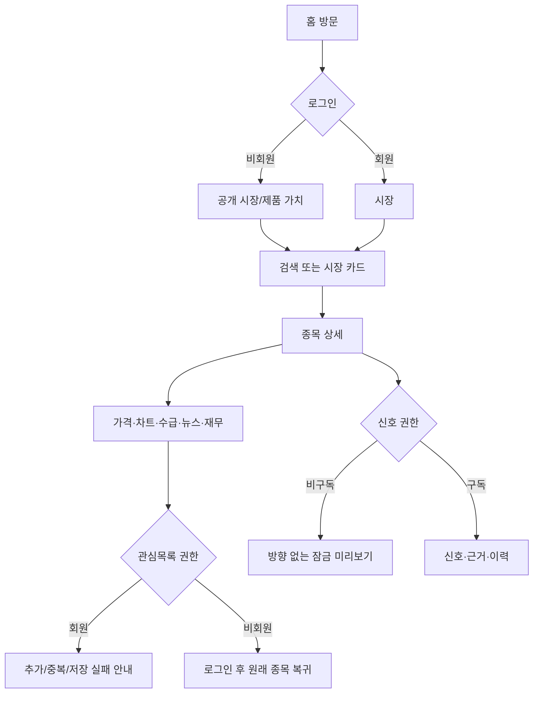
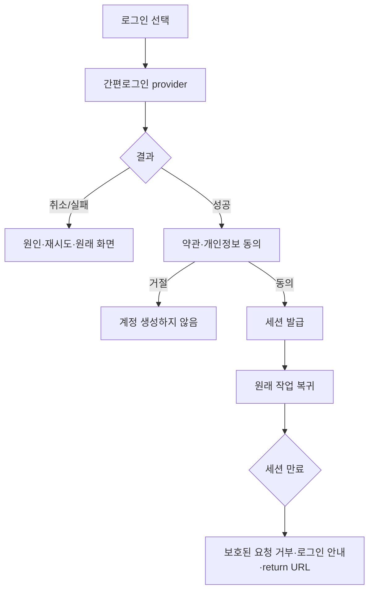
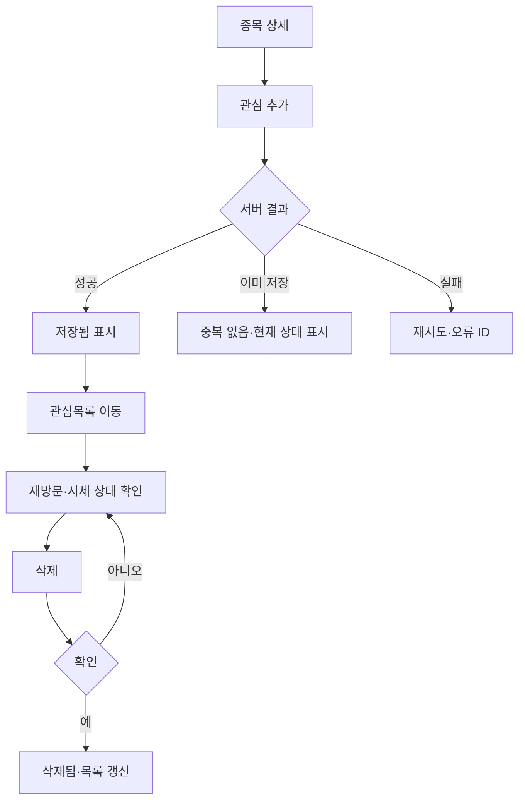
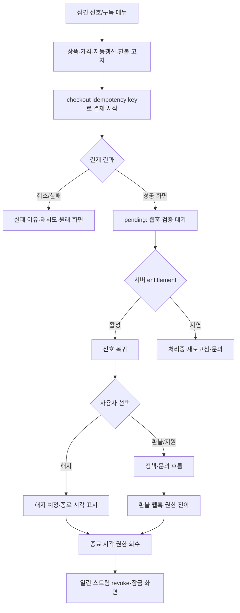
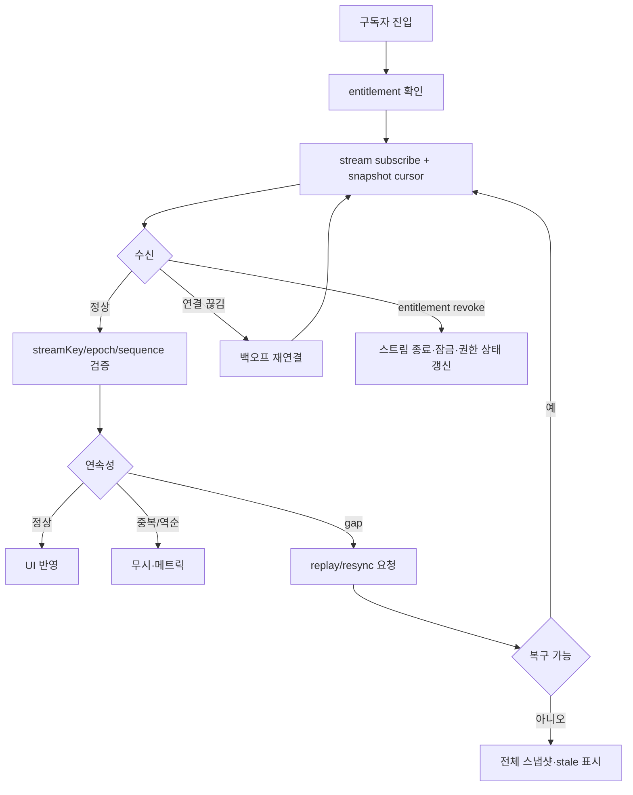

# 04. User Flow

## 1. 흐름 상태 규칙

- 인증 상태, entitlement 상태, 데이터 신선도, 작업 상태를 서로 다른 축으로 표시한다.
- 결제 성공 화면만으로 권한을 활성화하지 않는다. 서버 entitlement 확인 후 신호 화면으로 복귀한다.
- 사용자가 새로고침·뒤로가기·다중 탭을 사용해도 중복 결제나 권한 오표시가 없어야 한다.

## 1a. 리디자인 표현 규칙

행동 흐름과 권한 전이는 변경하지 않는다. 다만 시장 진입 시 `시장 테이프 → 시장 레이더 → movers → 검색/종목 상세` 순으로 시선을 유도하고, 종목 상세에서는 `quote strip → 가격 흐름 → signal dossier → 근거/상태` 순으로 같은 작업을 표현한다. 가로 테이프와 상단 명령 바는 기존 route를 바꾸지 않으며 모바일에서는 하단 탭으로 동일 목적지에 도달한다.

## 2. 방문자·회원·종목 분석

## 3. 로그인과 세션

## 4. 관심목록 P0 흐름

## 5. 구독·결제 전체 생명주기

## 6. 실시간 흐름과 복구

## 7. 오류·복구 규칙

| 상황 | 상태 | 복구 |
|---|---|---|
| 검색 결과 없음 | empty | 검색어 수정 |
| 로그인 만료 | auth-required | 재로그인 후 return URL |
| 결제 처리중 | payment-pending | 상태 조회/문의, 중복 결제 금지 |
| 결제 실패 | payment-failed | 공급자 사유·재시도 |
| 구독 해지 예정 | cancellation-scheduled | 종료 시각·재개 정책 표시 |
| 환불 처리중 | refund-pending | 권한 정책에 따라 잠금/유지 표시 |
| 스트림 gap | resync-required | replay 또는 snapshot |
| 공급자 지연 | stale | 마지막 정상 시각·재시도 |
| 서버 오류 | error | requestId·재시도·문의 |

## 8. 흐름 수용 기준

- PRD-001~011 각각 진입·성공·실패·복구 화면이 있다.
- 결제 결과와 entitlement 활성화가 분리되어 있다.
- 관심목록은 추가뿐 아니라 재방문·삭제까지 검증한다.
- 권한 회수 후 열린 스트림에서 프리미엄 이벤트가 더 이상 전달되지 않는다.
